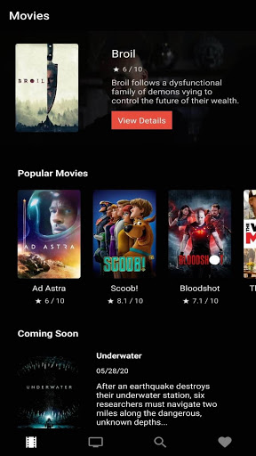

# Wanflixpo

「Wanflixpo」is an application that helps people discover movies and tv shows.

Read this in other languages: [English](./README.md), [日本語](./README.ja.md), [한국어](./README.ko.md)

## Release

Android

## Technologies

This project is created with:

- React Native
- Expo: 37.0.3
- Styled components: 5.1.0

## Screenshots

|  |     |
| :--------------------------------------------------------------------: | :-----------------------------------------------------------------------: |
|                              Movie lists                               |                                  Detail                                   |
|  |  |
|                                 Search                                 |                                 Discovery                                 |

## Features

Wanflixpo provides features like below.

### Listing Movies

Lists movies that are popular recently, will be released soon, and etc.

### Listing TV shows

Lists TV shows that are ranked in top, popular recently, airing today, and etc.

### Search

Can search movies or TV shows by its title.

### Movie・TV show Detail

Can view the detail by selecting a movie or a TV show in the lists.\
Detail includes information such as overview, languages, genre, or teaser clips.

### Discovery

Can discover new movies by flipping cards showing a poster of the movie overlapped each ohter.
