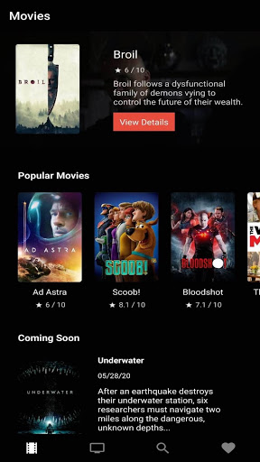
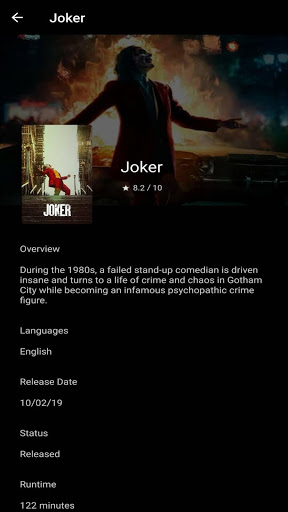
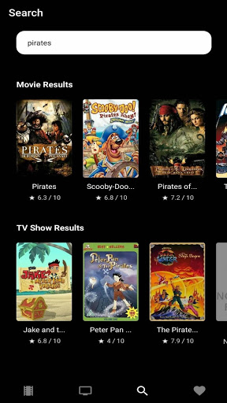

# Wanflixpo

"Wanflixpo"는 영화 정보 제공 어플리케이션입니다.

Read this in other languages: [日本語](./README.md), [English](./README.en.md), [한국어](./README.ko.md)

## 릴리즈

    Android: 

## 사용 기술

이 프로젝트에 사용한 주요 기술은 다음과 같습니다.

- React Native
- Expo: 37.0.3
- Styled components: 5.1.0

## 스크린샷

|  |     |
| :--------------------------------------------------------------------: | :-----------------------------------------------------------------------: |
|                               영화 일람                                |                                 작품 상세                                 |
|  |  |
|                                  검색                                  |                                디스커버리                                 |

## 기능

wanflix로 다음과 같은 기능을 이용할 수 있습니다.

### 영화 일람

최근 인기 영화, 개봉 예정 영화 등을 리스트 형식으로 표시합니다.

### TV쇼 일람

평점이 높은 TV쇼, 최근 인기인 TV쇼, 오늘 방영 예정인 TV쇼 등을 리스트 형식으로 표시합니다.

### 검색

타이틀로 영화나 TV쇼를 검색할 수 있습니다.

### 작품 상세

각 리스트 내의 작품을 클릭하여 작품의 상세 정보를 볼 수 있습니다.
상세 정보에는 작품 개요, 언어, 장르, 티저 영상 등이 포함됩니다.

### 디스커버리

영화 포스터가 카드 형식으로 겹친 상태로 표시되어, 한 장 한 장 플립하면서 새로운 영화를 확인할 수 있습니다.
