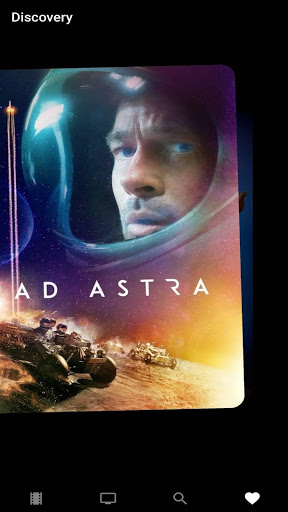

# Wanflixpo

「Wanflixpo」は映画情報提供アプリケーションです。

Read this in other languages: [日本語](./README.md), [English](./README.en.md), [한국어](./README.ko.md)

## リリース

    Android: 

## 使用技術

このプロジェクトで使った主な技術は以下のどおりです。

- React Native
- Expo: 37.0.3
- Styled components: 5.1.0

## スクリーンショット

|  |     |
| :--------------------------------------------------------------------: | :-----------------------------------------------------------------------: |
|                                映画一覧                                |                                 作品詳細                                  |
|  |  |
|                                  検索                                  |                              ディスカバリー                               |

## 機能

wanflix では、以下のような機能が利用できます。

### 映画一覧

最近人気の映画、まもなく公開する映画などの一覧を表示します。

### TV ショー一覧

評点が高い TV ショー、最近人気の TV ショー、今日放映予定の TV ショーなどの一覧を表示します。

### 検索

タイトルで映画や TV ショーを検索できます。

### 作品詳細

一覧の映画や TV ショーをクリックすることで作品の詳細を見ることができます。\
作品概要・言語・ジャンル・ティーザー動画などの情報が表示されます。

### ディスカバリー

映画のポスターがカード形式で重ねて表示され、フリップしながら新しい映画を確認できる機能です。
